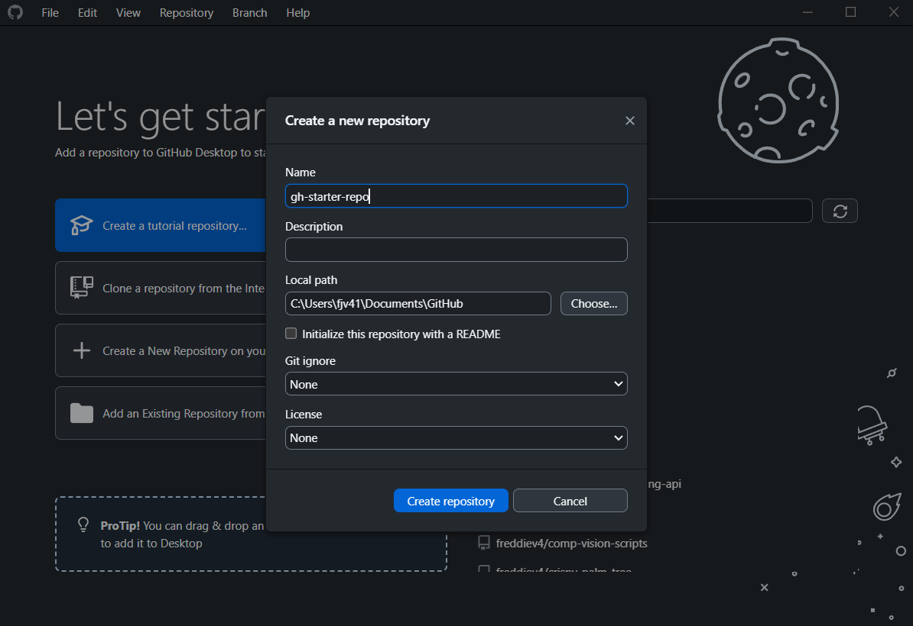
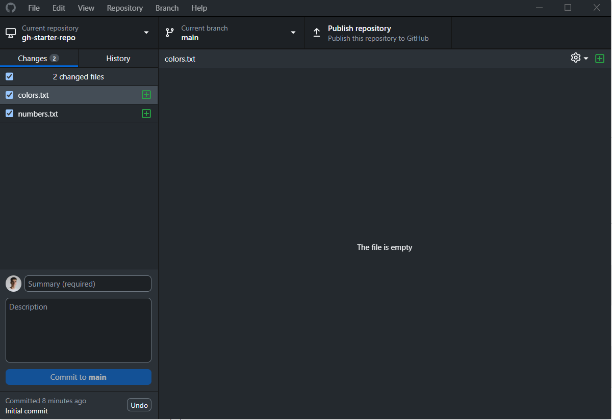
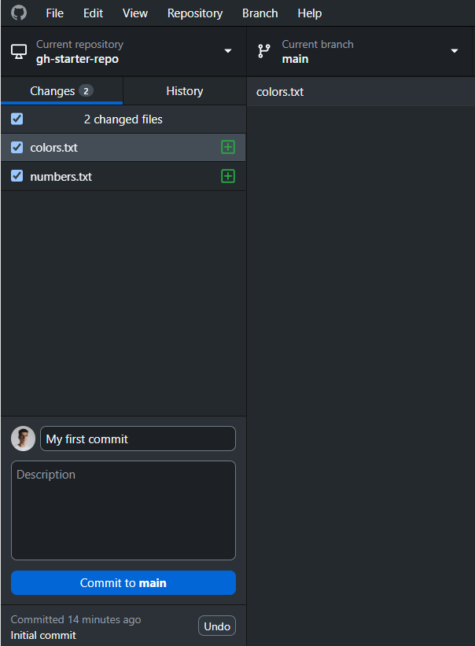
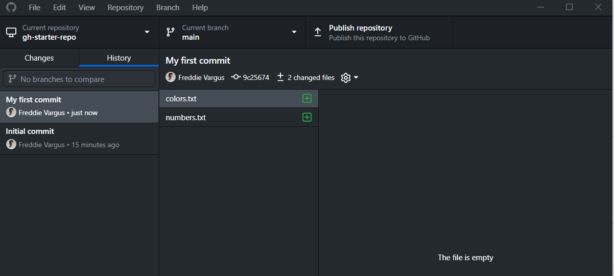
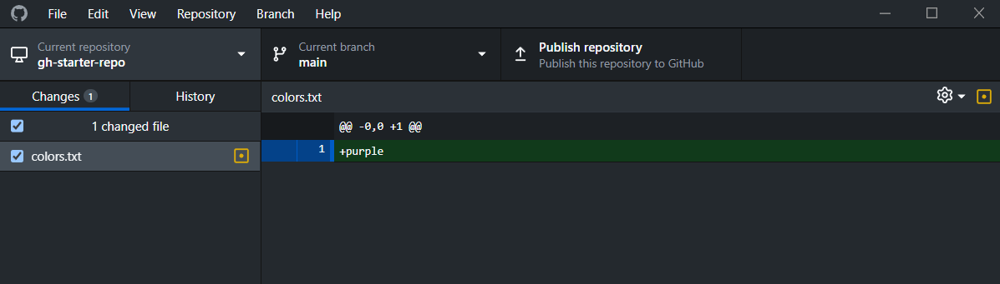
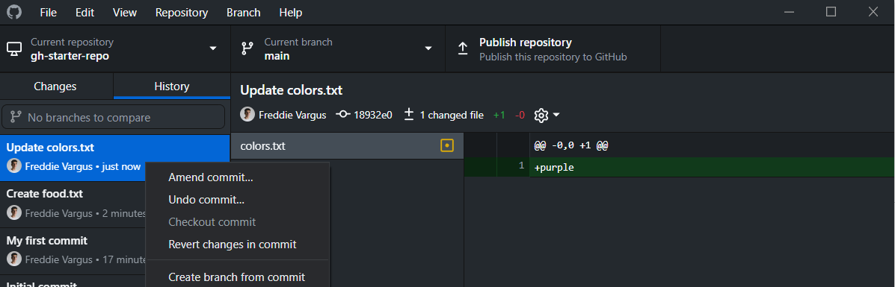

# Setup

## Install & Configure GitHub Desktop


Click `Sign in with GitHub`


# Initializing a repository

A repository contains all of your project's files and each file's revision history. We’re going to create a new repository with GitHub Desktop.

Click on the `Create a new Repository` button and do the following:

- give your repository a name
- check `Initialize this repository with a README`. 
- make note of where the repository will be created (`Local Path`)
- leave the remaining fields blank or None



Click `Create repository`.

# .git

Once a repository has been initialized, it will have a hidden directory called `.git`. This is where all of our version history ends up being stored.


# Open the repo in a code editor

If you made a note of where the repository was created, then open that same folder / project in a code editor (VS Code, Sublime Text, etc).

At this point we'll be switching back and forth between the Editor and the GitHub Desktop app.

# git status

We’re going to add some files. In your Editor, add two empty files:

- colors.txt 
- numbers.txt

Git should pick up these files. To check, switch back to the Desktop app. You should see "2 changes files` in the left sidebar.




# Committing files


We’re going to use a common mailing analogy to explain the staging area of Git.


When you’re working with files in git, you add content to the staging area, by checking the boxes next to the file names.

This is analogous to putting a jacket, that you want to mail, in a box. You then record the changes into the git index using a commit. You do this by adding a summary and then clicking `Commit to main`.



This is analogous to sealing the box and adding a shipping label.


## Why do we need to stage changes?

It is good practice to consider every commit as a *logical unit* of change. If you update 2 files that have independent changes, it's logical to break up those changes into two commits (or more).

# Viewing our commit

Now that we’ve committed our files, let’s see the commit in our log, by clicking on the `History` button in the left side bar.



The log shows all commits listed from most recent at the top, to least recent at the bottom.

Things that you’ll see here are the name of the author, the email, the date, a random-looking (but not actually random) string known as the commit SHA or commit hash, and the message that is associated with the commit


# More changes, undoing, fixing mistakes

We’ve covered how to take a snapshot of files. We’re now going to make changes those files, and we’re going to purposefully commit mistakes and try to fix them.


This can often one of the more difficult parts of using git, especially as the number of files and number of changes increases, but also being able to undo a set of changes can be one of the biggest benefits.


Continuing... open up `colors.txt` with your favorite text editor / IDE and type in a color you like. Save the file. We’re going to see what we changed:

- Anything in red (nothing currently) will show us things that we removed from the file
- Anything in green will show us things that we added to the file.



Add a new file called `food.txt`:

```console
touch food.txt
```

You should now have two sets of changes that are in the staging area. Uncheck both boxes.


# Add and commit again

Add your changes independently. Check one box, then commit that file.

Then check the other box, and commit *that* file.

Now let’s say you put the wrong color, or you wanted to commit something different from what you had written. How do we undo the commit?

Check your `History` tab. Right click the commit where you updated `colors.txt`, and click `Undo Commit`.




What happened to the file? What happened to your git history?
