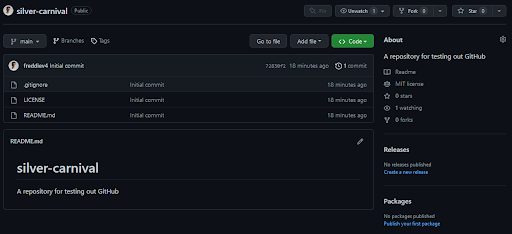
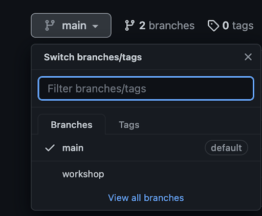

# Setup Part 1 (on your machine)

Create new SSH keys for GitHub for secure access and repository writes

```console
ssh-keygen -t ed25519 -C "your_email@example.com"

# OR, if your machine doesn’t support ed25519

ssh-keygen -t rsa -b 4096 -C "your_email@example.com"
```

Press `Enter` to accept the default file location. When asked, type a secure passphrase (or leave it empty).
**NOTE**: When you type a passphrase, you will not see it appear in the terminal. This is a general terminal security measure. Type carefully.


```console
> Enter passphrase (empty for no passphrase): [Type a passphrase]
> Enter same passphrase again: [Type passphrase again]
```

Start the ssh-agent

```console
eval "$(ssh-agent -s)"
```

Add the ssh key to the agent

```console
ssh-add ~/.ssh/id_ed25519

# OR, if you used rsa in the ssh-keygen step

ssh-add ~/.ssh/id_rsa
```

# Setup Part 2 (on your GitHub account)

Add your public SSH key (ends in .pub) from the file to your clipboard from your terminal

```console
pbcopy < ~/.ssh/id_ed25519.pub <-- if this doesn’t work, then open the file in a text editor and copy it
```

Go to github.com/settings, click `SSH and GPG keys`, and then click `New SSH key`.

Paste the key into the text box and click Add SSH key

Test your connection in your terminal with `ssh -T git@github.com` (might take a second). Type `Yes` if prompted. You should see similar text to the below.

```console
Hi freddiev4! You've successfully authenticated, but GitHub does not provide shell access.
```


# Fork a repository

1. Go to `https://github.com/freddiev4/silver-carnival`
2. Click the Fork button
3. Check that you now have a copy of the repository on your GitHub account (go to github.com/yourusername and look at the `repositories` tab)




# git clone your fork

From your command line, run:

```console
cd							     <-- to bring you back to the root of your file system
git clone git@github.com:yourusername/silver-carnival.git  <-- to get a local copy of the repository
cd silver-carnival 					     <-- to make this your active working directory
git status 					      	     <-- to ensure you’re in the right place (main branch)
```

# Make changes to the fork

Using some familiar commands…

```
git checkout -b yourusername/feature
touch yourusername.txt
git add yourusername.txt
git commit -m "Add my username to the repo"
```

# Push your changes

Run:

```console
git push -u origin HEAD
```

- `-u` is a shortcut for --set-upstream-to, which tells Git where send the changes
- `origin` is the default name for the remote repository, and is set to the URL of the repository
- `HEAD` is the name of the current (latest) commit on your branch

If that command fails, look at the output and follow what git tells you to do.

# See your changes on GitHub

Go to github.com/yourusername/silver-carnival, click the branch dropdown, and then your branch name to see your changes



And we'll continue back to the main workshop.


	   